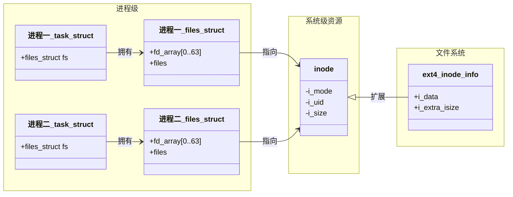

1. 教程： https://blog.csdn.net/Ji_maxwell/article/details/138358796#:~:text=%E4%BD%86%20Linux%20%E7%B3%BB%E7%BB%9F%E4%B8%AD%E9%BB%98%E8%AE%A4%E6%B2%A1%E6%9C%89%E5%AE%89%E8%A3%85%20%E4%B8%AD%E6%96%87%E5%AD%97%E4%BD%93%EF%BC%8C%E9%9C%80%E8%A6%81%E6%89%8B%E5%8A%A8%E4%B8%8B%E8%BD%BD%E5%AD%97%E4%BD%93%E6%96%87%E4%BB%B6%EF%BC%8C%E4%BD%86%E5%A6%82%E6%9E%9C%E6%98%AF%E5%9C%A8Windows%20Linux%E5%AD%90%E7%B3%BB%E7%BB%9F%EF%BC%88wsl2%EF%BC%89%E4%B8%8A%E5%8F%AF%E4%BB%A5%E6%9C%89%E6%9B%B4%E7%AE%80%E5%8D%95%E7%9A%84%E5%A4%84%E7%90%86%E5%8A%9E%E6%B3%95%EF%BC%8C%E5%8F%82%E8%80%83%E6%96%87%E7%AB%A0%20WSL2,%E5%AE%89%E8%A3%85%E4%B8%AD%E6%96%87%E5%AD%97%E4%BD%93%EF%BC%8C%E8%BF%90%E8%A1%8C%E4%BB%A5%E4%B8%8B%E5%91%BD%E4%BB%A4%20%E9%80%9A%E8%BF%87%E4%BD%BF%E7%94%A8%20Windows%20%E8%87%AA%E5%B8%A6%E5%AD%97%E4%BD%93%E7%9A%84%E6%96%B9%E5%BC%8F%EF%BC%8C%E6%9D%A5%E5%AE%9E%E7%8E%B0%E5%BF%AB%E9%80%9F%E5%AE%89%E8%A3%85%E4%B8%AD%E6%96%87%E5%AD%97%E4%BD%93%E3%80%82%20%E6%8E%A5%E4%B8%8B%E6%9D%A5%E8%BF%90%E8%A1%8C%20%E5%88%B7%E6%96%B0%E5%AD%97%E4%BD%93%E7%BC%93%E5%AD%98%E3%80%82%20%E8%BF%99%E9%87%8C%E5%A6%82%E6%9E%9C%E6%8A%A5%E9%94%99%EF%BC%8C%E5%AE%89%E8%A3%85fontconfig%E5%8D%B3%E5%8F%AF

