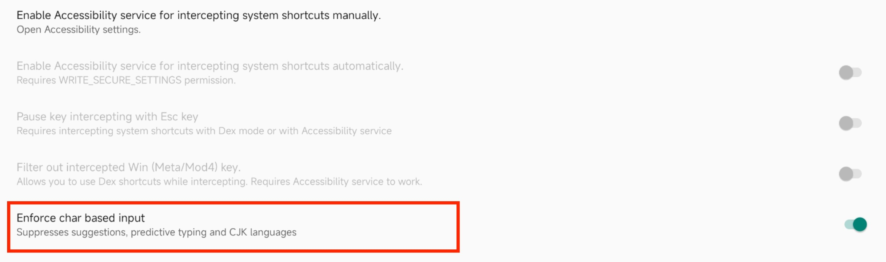
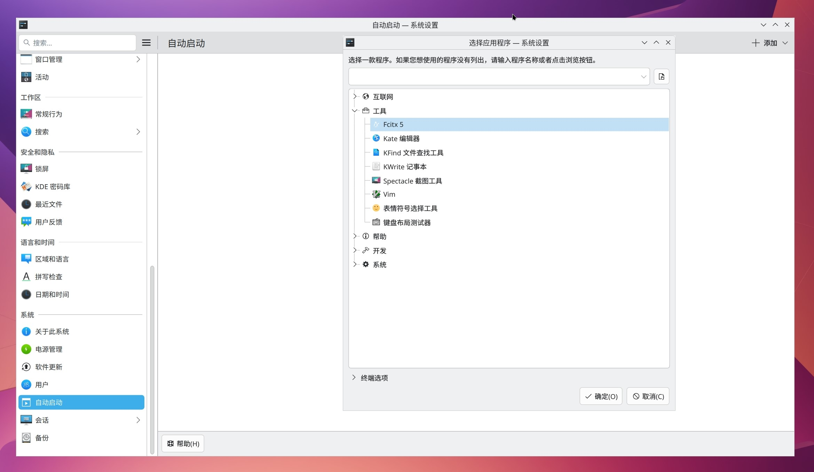
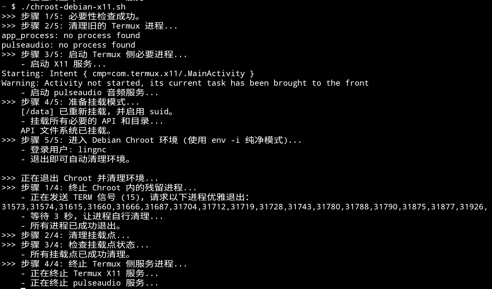

2. 测试环境：Xiaomi Pad 6 Max，Termux Debian，有root权限
3. 参考教程：
	1. [Termux Chroot Ubuntu 教程](https://ivonblog.com/posts/termux-chroot-ubuntu/)[ivon-termux-chroot-ubuntu配置](ivon-termux-chroot-ubuntu配置.md)
	2. [Debian KDE 官方文档](https://wiki.debian.org/zh_CN/KDE)
	3. [Bilibili 相关教程](https://www.bilibili.com/opus/1042342069764358179?plat_id=5&share_from=article&share_medium=android&share_plat=android&share_session_id=267ddb80-f0aa-43eb-ba49-aef61e2e2d0c&share_source=COPY&share_tag=s_i&spmid=dt.opus-detail.0.0&timestamp=1754956100&unique_k=1eBfRK5)([本地存储](b站专栏.txt))
	4. [Tmoe chroot启动脚本](https://github.com/foundations/tmoe-linux/blob/master/share/container/chroot/startup)
4. 安装桌面环境（Chroot的环境参考[8. Termux Chroot环境创建](8.%20Termux%20Chroot环境创建.md)）
5. 配置Termux X11
	1. 安装 Termux:X11 后，建议先设置 Preferences。若连接键鼠使用，建议修改图中橙色方框中的选项为图中所示配置；若需要在 Linux 容器中正常使用 Alt + Tab 等快捷键，需要在安卓设置中打开 Termux:X11 的无障碍服务，如图中绿色方框中所示。根据图片中圈出的部分进行修改为图中所显示的样子
	
	
	
	蓝色的框打开之后会进入无障碍设置开启即可
	
	2. 对于比较新的X11版本，在使用的时候会默认使用安卓的输入法，影响一些输入
		开启 Termux:X11 Preferences 的 **Keyboard -> Enforce char based input** 选项。
		
6. Termux安装重要的软件包和源
	1. 安装下载源
	```bash
	# 安装x11-repo源
	pkg install x11-repo
	# 更新软件包
	pkg update && pkg upgrade
	# 安装必要的软件包
	pkg install termux-x11-nightly # mesa-zink vulkan-loader-android
	# mesa zink 和 vulkan-loader-android是为了支持vulkan，让一些需要vulkan的程序能运行，但是之后的freedreno驱动也支持一定的vulkan，所以选择安装
	# 安装音频服务
	pkg install pulseaudio
	```
7. KDE
	1. 安装最小化安装
	```bash
	sudo update
	sudo apt install kde-plasma-desktop
	```
	2. 关闭kde的桌面特效（使用x11渲染的情况下，不关闭无法正常使用）
		不要启动 KDE 桌面会话，先使用 vim 等工具编辑 `~/.config/kwinrc` 文件（若用户目录下 `.config` 文件夹不存在需要先新建），禁用 KDE 的桌面特效，在 `[Compositing]` 部分添加或修改以下内容：
	```ini
	[Compositing]
	Enabled=false
	```
8. 安装输入法fcitx5
    1. 在chroot容器内
	```bash
	sudo apt install fcitx5 fcitx5-pinyin
	```
	2. 配置环境变量解决在 Chromium、VS Code 等“浏览器套壳”应用无法激活 fcitx 5 输入法
	```bash
	# 编辑 /etc/environment 文件
	sudo vim /etc/environment
	
	# 追加以下内容
	GTK_IM_MODULE=fcitx
    QT_IM_MODULE=fcitx
    XMODIFIERS=@im=fcitx
    SDL_IM_MODULE=fcitx
	```
	3. 设置自动启动输入法
		进入 桌面之后在KDE 桌面中进行设置设置自动启动的程序即可，因为要和kde桌面在同一个dbus会话中
		这是最简单、最标准的“KDE原生”方法。
	    1. 在您的 KDE 桌面中，打开“系统设置”(System Settings)。
        2. 在左侧的搜索框中，输入“自动启动”(Autostart)。
        3. 点击进入“自动启动”管理页面。
        4. 点击左下角的“添加...”按钮，然后选择“添加应用程序...”(Add Application...)。
        5. 系统会弹出一个应用程序列表，在里面找到 Fcitx 5 并选中它，然后点击“确定”。
		设置完成后，KDE 就会在您每次登录时自动为您启动 fcitx5。
		
		这个操作背后发生了什么？
    	> 它会在 ~/.config/autostart/ 目录下创建一个名为 org.fcitx.Fcitx5.desktop 的文件，KDE 会在启动时自动加载这个目录里的所有 .desktop 文件。
2.  启动桌面环境进行测试（软件渲染）
	1. 配置启动前的设置全局环境变量
	设置 XDG_RUNTIME_DIR ，该环境变量在正常的 Linux 系统上由 systemd 自动设置，但当宿主系统为 Android 时，Linux 容器应该无法使用 systemd，故需手动设置。
	设置 DISPLAY （与Termux x11启动的编号要对应）。
	使用root创建并编辑 /etc/profile.d/XDG.sh 配置这两个环境变量，配置之后重新登录生效
    ```bash
	# 编辑 /etc/profile
	sudo vim /etc/profile.d/kde-env.sh
	
	# ------ 写入以下内容 ------
	
	# 设置 XDG_RUNTIME_DIR 和 DISPLAY 环境变量
	export XDG_RUNTIME_DIR="/run/user/$(id -u)"
	export DISPLAY=":1"
	
	# 强制 X11（不要 Wayland）
    export XDG_SESSION_TYPE=x11
    export QT_QPA_PLATFORM=xcb
    ```
	重新登录生效
	2. 为用户创建运行时文件夹
	```bash
	sudo mkdir -p "$XDG_RUNTIME_DIR"
	sudo chown $USER:$USER "$XDG_RUNTIME_DIR"
	chmod 700 "$XDG_RUNTIME_DIR"
	```
	3. 安装必要程序
	```bash
	sudo apt update
	sudo apt install xinit dbus-x11
	```
	4. 启动 dbus 启动 plasma
	先在Termux中启动 termux-x11，然后登入chroot启动plasma
	```bash
	# 启动termux-x11
	termux-x11 :1 -ac &
	
	# 登录chroot
	su -c ./chroot-debian.sh
	
	# 启动plasma
	dbus-launch --exit-with-session /etc/X11/Xssession
	```
	进入Termux X11查看桌面是否正常显示，显示成功即可
3. 对应家目录中文件夹是中文的不方便看可以调成英文的()[16. 家目录中的文件夹在中文环境下自动生成中文改回英文](16.%20家目录中的文件夹在中文环境下自动生成中文改回英文.md)
4. 安装新的软件[Termux:Widget](https://github.com/termux/termux-widget/releases/download/v0.15.0/termux-widget-app_v0.15.0+github.debug.apk)，用来添加安卓小组件方便使用脚本启动（具体参考：[11. 使用Termux Widget快速启动脚本](11.%20使用Termux%20Widget快速启动脚本.md)）
5. 建立新的启动脚本
    在使用桌面之后，之前的chroot-debian测试启动脚本不再好用，因为启动kde等进程之后，及时已经退出有些进程会在后台占用chroot文件夹中的一些自动，例如/dev,/proc,/sys等文件夹，导致无法正确退出挂载并且完全的退出系统，因为这些进程相当于还在安卓内核中运行着。
    1. 创建新的启动脚本（点击该链接打开[X11启动脚本](chroot-debian-x11.sh)）。
	2. 访问脚本，将脚本前面的配置参数部分按照自己的设置进行更改，例如chroot的路径，用户名等。
	3. 将该脚本保存到~/.shortcuts/，就可以在桌面直接打开并且访问了
	